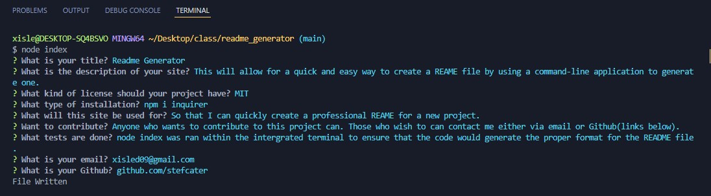

  
  # Readme Generator

  
  ----
  ## Table of Contents
  - [License](#license)
  - [Description](#description)
  - [Installation](#installation)
  - [Usage](#usage)
  - [Contributions](#contributing)
  - [Tests](#testing)
  
  ## Description
    This will allow for a quick and easy way to create a REAME file by using a command-line application to generate one.

  ## License
  
    The project is licensed under MIT
     
    [License: MIT](https://opensource.org/licenses/MIT)

  ## Installation
    npm i inquirer

  ## Usage
    So that I can quickly create a professional REAME for a new project.

  ## Contributions
    Anyone who wants to contribute to this project can. Those who wish to can contact me either via email or Github(links below).

  ## Testing
    node index was ran within the intergrated terminal to ensure that the code would generate the proper format for the README file.

  ## Questions
   You can reach me at xisled09@gmail.com
    
   or
    
   Find me at github.com/stefcater

  ----
    
  ## Screenshot
  